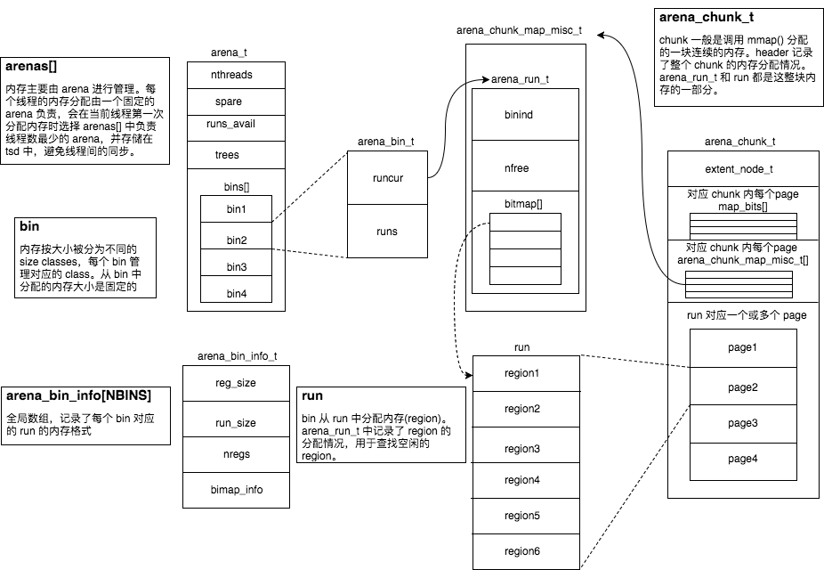

# allocator

一个支持多线程的内存池, 设计参考了 jemalloc.  
将内存分为不同大小来减小内部碎片和锁的粒度, 每一个大小级别都有相应的缓存, 对于小块内存采用`slab`和`bitmap`增加空间利用率, 提高性能. 能在常数时间内获取对应内存的管理单元.  
使用内存着色防止cache line颠簸.  
自动合并空闲块, 减小内存碎片.  
使用`tcache`绑定`arena`的方法提高多线程性能, 能动态调整`tcache`中缓存块容量, 减小不必要的内存占用. 并且能正确处理由不同线程释放带来的问题.  

## 使用

### 编译
`g++ -O2 myalloc_test.cc run.cc`

### 运行测试
`./a.out 1`执行测试  
`./a.out 0`作为对比, 使用`malloc`和`free`

### 调整参数

`tuning.h`
- `MIN_REGION_NUM`调整一个`run`的最小`region`数量
- `TCACHED_MAX`tcache里一个bin的最大容量(影响到tcache的缓冲内存块数量)
- `TCACHE_GC_INCR`tcache多少次操作之后进行GC
- `memory_leaks_detecet`简单的内存泄漏检测, 具体是tcache析构函数里调用`~Arena()`, Arena在整理完后检查是否有空闲page空闲run未归还.
- `bulk_alloc`让tcache向arena批量申请

`myalloc_test.cc`
- `thread_num`测试线程数
- `inner_loop`测试内循环数, 连续alloc的数量
- `outer_loop`测试大循环数
- `size_switch`选择测试用例的大小
- `enable_memset`是否开启memset. 容量大了之后memset会对性能有比较大的影响, 掩盖了内存分配器的差距. 但是开启memset的好处是, 有些时候malloc快的不真实, 可以试试这个. 还可以起到一定的分配错误检测功能.
- `release_type_switch`选择一次大循环后是按顺序全部释放还是随机释放一部分内存. 随机释放会让下次分配前不是完整的一块, 变得有碎片.

## 概念说明

### 几个class/struct
三个容器: `arena`, `bin`, `tcache`.  
三种容量: `chunk`, `page`, `region`.  
`arena`里有空的chunk(spare, chunk_tree)和page(avail_pages), `bin`里有半空的run, `tcache`里有空的region

### 概述

大小分为small, large和huge三档, 选择精细的内存大小而不是伙伴系统的简单的二的次幂来减小内部碎片.

对于small, 是run(slab)在管理. small的每个大小对于一个bin, bn中是当前使用的run和一些通过红黑树组织的非空的run. 里面的定长的小块称为region(其实也不小了, 最大的有14KiB)

对于large, 直接分配数个page. page又avail_pages进行管理, 也是一颗红黑树.

对于large, 直接分配chunk, 管理的chunk有两颗树, 一棵是红黑树, 另一棵也是红黑树. 好吧, 按地址排序和按剩余容量大小排序, 因为不仅需要从红黑树中找大小大于当前块的块, 还需要依靠地址棵树查找是否有相邻的chunk, 合并时要用. 至于page为什么不需要, 后面再说. 另外还有个spare指针, 指向最近释放的chunk, 避免频繁操作树.

### 结构

chunk的头部有几个page不分配, 存储page的管理单元. 一个管理单元对应一个page. 对于small size, 存的是管理单元对应的page对应的run的管理单元, 只存在run的第一个page的管理单元中. 还有run_offset, 当前page距离run的第一个page的距离(说不明白, 不管了). 对于large, 存大小, 也就是page数量. 包括每个page的记录信息, chunk 所属arena

具体的, 对应的的管理信息存在chunk中, arena像是更大的调度. 反正arena里的是指向空闲page, chunk的指针, 用RBTree管理. arena里还有bins, 多个bin的数组. 操作small时候, 根据大小得到bin_id, 就得到了bin所在. bin是run的指针管理者. 总之arena里面净是指针, 和chunk里的管理单元的感觉不一样.

最后上图:



怎么分配释放合并清理, 常数时间内几个概念相互转换. 懒得写了

附一张small size对照表, 测试时候生成的, 顺便附过来了.

```text
region_size: 8, page_num:1, region_num:512
region_size: 16, page_num:1, region_num:256
region_size: 32, page_num:1, region_num:128
region_size: 48, page_num:3, region_num:256
region_size: 64, page_num:1, region_num:64
region_size: 80, page_num:5, region_num:256
region_size: 96, page_num:3, region_num:128
region_size: 112, page_num:7, region_num:256
region_size: 128, page_num:1, region_num:32
region_size: 160, page_num:5, region_num:128
region_size: 192, page_num:3, region_num:64
region_size: 224, page_num:7, region_num:128
region_size: 256, page_num:1, region_num:16
region_size: 320, page_num:5, region_num:64
region_size: 384, page_num:3, region_num:32
region_size: 448, page_num:7, region_num:64
region_size: 512, page_num:1, region_num:8
region_size: 640, page_num:5, region_num:32
region_size: 768, page_num:3, region_num:16
region_size: 896, page_num:7, region_num:32
region_size: 1024, page_num:1, region_num:4
region_size: 1280, page_num:5, region_num:16
region_size: 1536, page_num:3, region_num:8
region_size: 1792, page_num:7, region_num:16
region_size: 2048, page_num:2, region_num:4
region_size: 2560, page_num:5, region_num:8
region_size: 3072, page_num:3, region_num:4
region_size: 3584, page_num:7, region_num:8
region_size: 4096, page_num:4, region_num:4
region_size: 5120, page_num:5, region_num:4
region_size: 6144, page_num:6, region_num:4
region_size: 7168, page_num:7, region_num:4
region_size: 8192, page_num:8, region_num:4
region_size: 10240, page_num:10, region_num:4
region_size: 12288, page_num:12, region_num:4
region_size: 14336, page_num:14, region_num:4
```

## 调试技术
`rand()`不重置种子可以呈现出多样又可复现的bug, 挺好的  
`CLion`可以方便的查看对象结构和内存(`x/8b 0x77777770000`)  
`gdb`可以方便的断点, `b arena.cc:207 if (chunk < 0x100)`, `watch *0x77777770000`(默认4字节内容), `watch`非常好用, `watch ((Arena*)0x5555555802b0)->bins[20].cur_run == 0x7ffff6c10020`(类成员就要把类地址写上不然gdb不认识), 可以看出越界访问, 忘记从cur_run中移除等等被意料之外的人写入的问题  
`gdb`的`p`可以执行函数, 非常好用  
打印地址(16进制)用 printf. `printf "%p", chunk + 1`, 就是比printf少了括号, 以前学过, 只是不记得了  
不能后退, 就打日志吧. 不像业务信息看了就明白, 还是慢慢断点一点一点往回查吧.  
内存泄漏和越界访问问题检测可以用`valgrind`, 可以编译时加上`-fsanitize=address`. #define memory_leaks_detecet就可以进行内存泄漏的测试
养成逻辑上不可能但是应该考虑的情况下多写点`assert`的习惯. 线程调到60的情况下`assert`都能过就没问题了

## 性能优化
最初写完的时候性能还比不上malloc.

用`perf record -g ./a.out`, `perf report -g`分析性能, 把几个对性能影响大的函数进行优化. 和想象的不同, tcache预分配内存花的时间不是问题, 但是`run`的`bitmap`非常影响性能. 先用`ffs`代替自己的循环, 再用 `std::bitset`, 性能有了明显提升.

还有是地址转换函数尽量多利用手上已有的, 不要上来就从头转换. 虽然是简单函数, 毕竟执行次数多还是影响大.

另外对占用较大的`TCache::alloc()`进行优化, 让`tcache`向`arena`集中申请分配, 调用`Arena::bulk_alloc_small()`, 性能有了明显提升  
(测试结果见[bulk_alloc_test](bulk_alloc_test.md))

另外就是找测试方法测试数据, 摸清分配器适合什么不适合什么.


## 性能测试

`myalloc_test.cc`是与malloc对比, 比较完善的基准测试  
`allocator_test.cc`是封装成类之后与`malloc`, `std::allocator`对比, 不完善  
主要用`myalloc_test.cc`进行测试
 
- 测试方法: 调整数据后重新编译, 均开启`-O2`优化

```shell
`g++ -O2 myalloc_test.cc run.cc && for ((i=0; i<3; i++)); do ./a.out 0 && ./a.out 1; done`
```

### 测试结果:

(数据仅供参考, 有时候过段时间测出完全不同的结果)

- `malloc`在 随机释放随机数量 下的性能比 按分配的顺序完全释放 差很多
- `malloc`在 块大小变大(64->1700) 的情况下 性能变差很快, `strace`查看发现, `futex`的用时占了了99.9%. 原因不明
- 对于小块, `TCACHED_MAX`内性能优于malloc, `TCACHED_MAX`外性能不如malloc. 观察到分配随机大小时, pt性能变得和my_alloc不相上下, 作为对比, my_alloc在分配FIX_SMALL和RAN_SMALL时用时几乎相同, 应该是有什么优化.
- 在更加符合实际情况的"分配随机大小, 按随机顺序释放一部分"的情况下, `my_alloc`性能优于`malloc`
- 线程数影响不大, 因为瓶颈在机器性能而不是线程竞争上吧
- `first fit`和`next fit`在随机释放下影响不大
- `inner_loop`和`outer_loop`数只有普通的线性影响, 没什么好说的

所以内存池适合**少量**, **频繁**, 分配释放**特定大小**内存. 缺点是不好释放, 什么时机, 如果合并了, 哪个是边界呢. 所以最好程序生命期中都需要用到的场景.

其实tcache才算个内存池


## ONE MORE THING

std::bitset, ffs, ffsll封装并且做了比较, 结果是:
- 使用`first fit`下, `bitset`随机数据和线性数据都快而稳定(必须O2). 肯定是编译器优化
- `next fit`下`bitset`不如另外两个.
- `bitmap64`稍快于`bitmap32`

[测试结果](bitmap_test.md)

## 最后

算是存档吧, 都没空做了, 把现有信息入栈.

### bug
- [x] ~~`bitmap`里`bitset`的`bitset_next_find`还是错的, 测`bench_ran()`会死循环(那个while). 应该是没初始化, 但是结果又不对. 有空去修.~~
- [x] 更新, 是`next fit`会炸, 这么短的东西怎么就写不好呢. 最后删了, 想要的话用`bitmap.h`里的就行了. ~~十多个以上的线程, loop多了会炸, 大小太大了好像也会炸. 开了RANDOM情况下SIZE大了会炸, 循环太多了可能也会炸. 炸的地方一般是`myfree`里的`assert`, 落到了`UNALLOCATED`, 一般是分配时候哪搞错了. 和`find_region`里的`assert`, 没有忘记初始化之类的情况的话, 就是`run`的管理出错了, 要继续往上查, 从哪来的, 怎么分配的, 什么时候被更改的. 和合并空闲page时从树中erase失败, 一般会碰到了一个莫名其妙的page num. 总之多线程问题倾向性于不是多线程带来的, 因为锁都很宽了, 而且arena数量还没到4倍~~

`next fit`就是写不对, 哎

### TODO

- [x] 去测一下随机释放后, 有碎片的情况下的分配的性能
- [x] 尝试让`tcache`一次向`arena`申请释放多块内存. 传参数不是问题, 但是对性能有帮助吗
- [x] `std::bitset`, `ffs`, `ffsll`比较, 封装.
- [ ] 给基准测试画图
- [ ] 加上命令行选项. 命令行里测试是用参数方便, ide里是直接改源文件方便, 测试用脚本写
- [ ] 内存池还有可以优化的地方. 在tcache剩余容量小于某个值的时候, 启动后台线程向arena申请分配. / 虽然引入锁了, 应该影响不大. 可以把缓存容器变成单读者单写者的无锁队列. / tcache就该是个缓冲压力的东西, 像水库一样. 就是不能预测后面会大量分配还是大量释放. 而且程序是同步的, 池子空之前提前去要也没什么好处, 都是阻塞, 可能高峰期延迟第一点的程度.
- [ ] 现在的想法是释放时绕过`tcache`, 见`myalloc.h`里面写的. gc是不是也要改. 多少次操作之后就分配或释放到标准线

有空一定, 有缘再见(雾)
